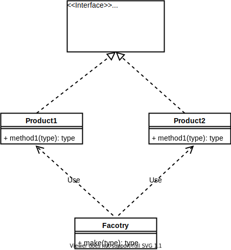
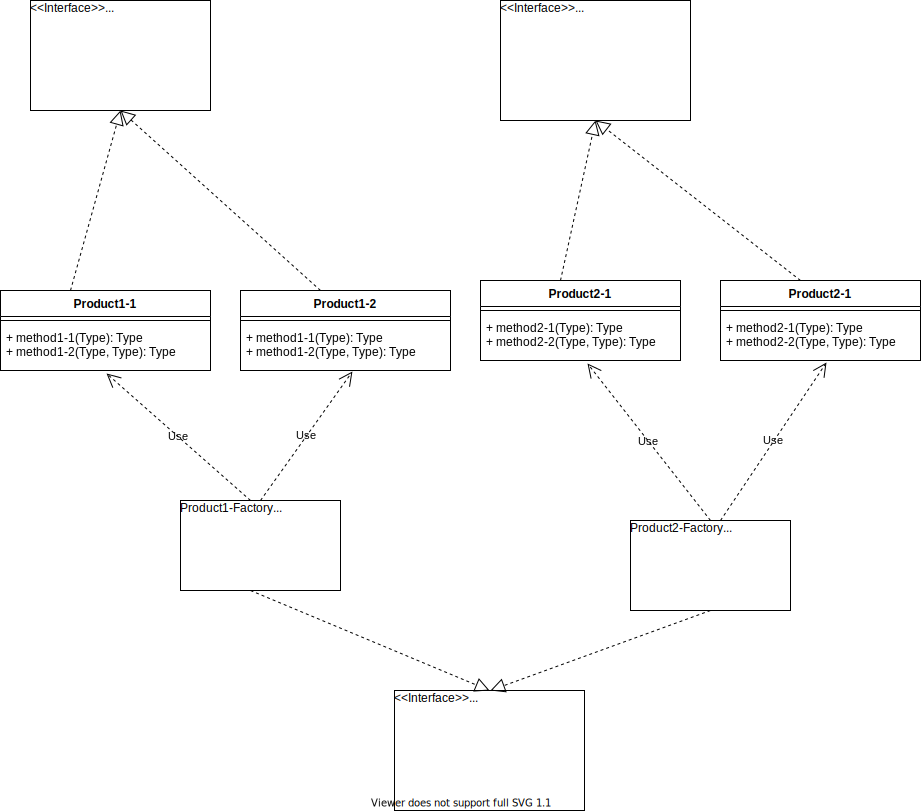
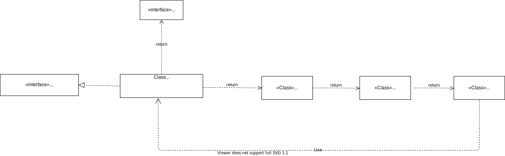

# client-go 中informer中的设计与实现

```
个人任务读源码的作用不是了解软件实现的工作流，更多的是思考，软件的设计模式和设计思想，未来自己在哪些地方可以使用。最后才是了解软件实现的工作流。
```

## informer的设计模式

下面一个简单的informer的使用的列子，从例子中寻找informer设计中使用过的方法。
```
package main

import (
	"time"

	"k8s.io/client-go/informers"
	"k8s.io/client-go/kubernetes"
	"k8s.io/client-go/rest"
	"k8s.io/client-go/tools/cache"
)

func main() {
	stop := make(chan struct{}, 1)
	defer close(stop)
	config := &rest.Config{
		Host: "",
	}
	client := kubernetes.NewForConfigOrDie(config)
	factory := informers.NewSharedInformerFactory(client, 1*time.Second)
	nodeInformer := factory.Core().V1().Nodes().Informer()
	nodeInformer.AddEventHandler(&cache.ResourceEventHandlerFuncs{})
	go factory.Start(stop)

	cache.WaitForCacheSync(stop, nodeInformer.HasSynced)

}
```

### 工厂模式
从上面的example中，可以看出informer的创建使用的是工厂设计模式，先简单介绍下两种常用的工厂设计模式：
- 简单工厂：定义一个工厂类，工厂类根据调用者传入的参数，分别实例化不通的对象。
    
  在上图中实现了一个工厂类Factory，Factory.make 可以根据调用者传入的不同参数分配实例化Product1和Product2返回
- 抽象工厂：抽象工厂是对简单工厂的再一次封装。将工程类的创建也改造成由工厂模式创建。
    
  从上图中可以看出，Product1-Factory和Product2-Factory是接口AbstractFactory的实现，虽然他们都有make1和make2方法，通常他们都只实现自己需要的那个方法。例如在Product1-Factory中，他的主要功能是产生Product1的。所以他的make2方法就是一个空实现。
  采用抽象工厂模式，通常还需要实现一个方法GetFactory，根据调用参数创建不同的Factory实例。Factory实例再根据不同的参数创建不通的Product实例。

client-go中informer使用的是哪种工厂方法呢。首先先梳理下informer的创建模式:  

从上图可以看出client-go中informer采用的是简单工厂，但是informerFactory在简单工程中又柔和了函数式编程中的链式调用。如example中`nodeInformer := factory.Core().V1().Nodes().Informer()`，`Core().V1().Nodes()`调用一直用factory和namespace等信息构造对应的group,version,resource.通过这些链式调用到指定的`Informer()`唯一实例化`sharedIndexInformer`.


## informer的实现流程

- informer初始化流程

如图所示，SharedInformerFactory根据GVR信息create对应的shareIndexInformer，SharedInformerFactory启动的时候，会启动SharedInformerFactory create的所有shareIndexInformer(`SharedInformerFactorycreate的shareIndexInformer每种资源(GVK)只会创建一个shareIndexInformer`)，shareIndexInformer启动的时候，会创建controller和Reflector并启动。从这里看一看出informer中主要的两个组件就是controller和Reflector。

- informer.controller组件


- informer.reflector组件