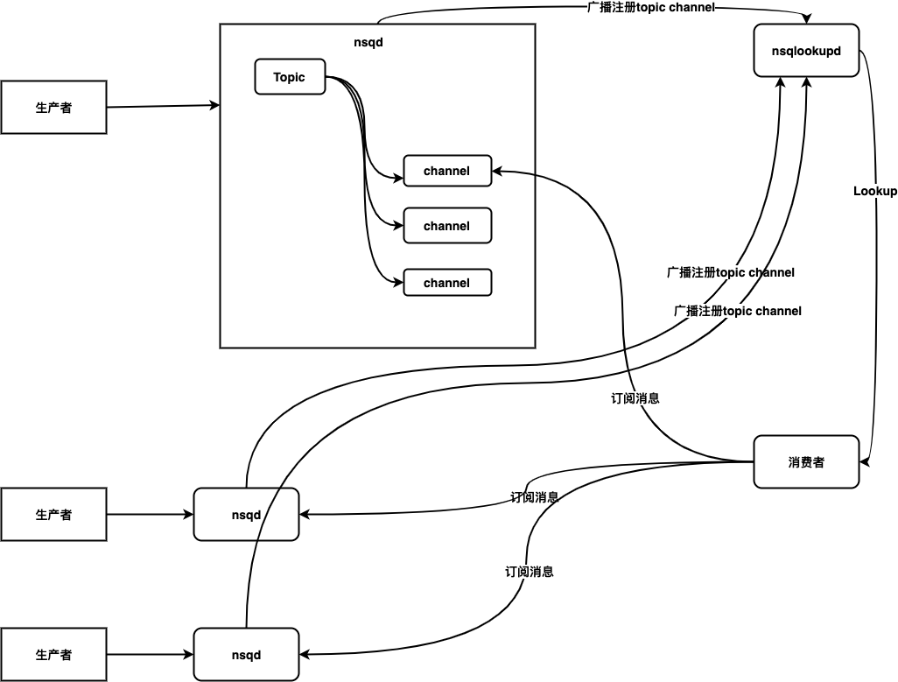
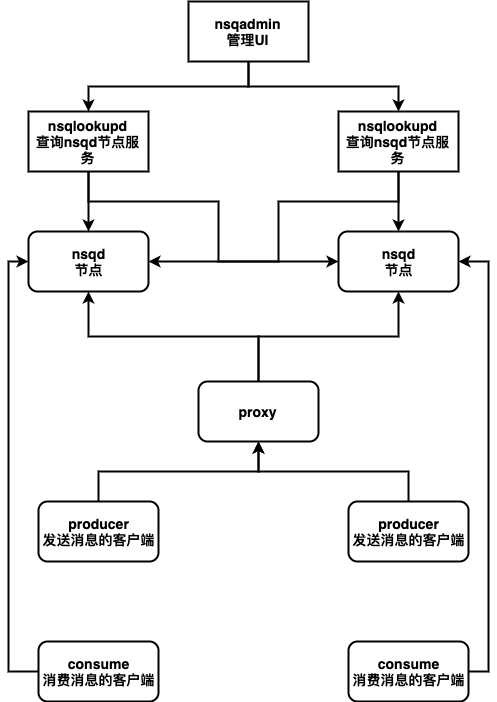

# 组件
* nsqd 是nsq中的工作组件，用于接收和传递消息。nsqd既可以独立部署，也可以与nsqlookupd配合做高可用部署。nsqd启动时会监听3个TCP端口，用于客户端的链接：4151为HTTP端口，4150为TCP端口，如果开启了HTTPS协议，他会在4152建立HTTPS协议的监听。

* nsqlookupd 是管理拓扑信息的守护程序。客户端可以查询nsqlookupd来发现Topic在哪些nsqd节点上。然后链接nsqd节点消费消息。nsqlookupd启动时也会启动2个端口:4161端口为HTTP端口用于客户端查询拓扑信息。4160为TCP端口用于nsqd注册拓扑信息。

* nsqadmin 是一个Web UI，用于实时查看聚合的群集统计信息并执行各种管理任务。

> nsq从设计上是一个简单配置和管理的MQ。在设计上nsq并不是作为一个一致性的集群对外提供消息队列服务。每个nsqd节点都是独立运行的，不共享任何状态。但nsqd节点启动后，它会向nsqlookup节点注册此节点上的topic和channel信息。nsqlookupd服务作为一个注册中心服务，但遗憾的是也不提供强一致协调能力。

# 概念

* Topic 主题，具有相同主题的消息会被归档到一起。当客户端第一次发送消息时，可以自动创建Topic。
* Channels 是一个与消费者相关联的概念，一个Channel可以绑定多个消费者，但是这多个消费者之间是竞争的关系。也就是一个channel里的消息只会被绑定到这个channel的所有消费者中的一个消费。一个Topic又可以绑定到多个channel中，Topic收到的消息会复制到所有的channel中。

> 这里用一个实际生产中的例子来说明Topic和Channels的关系。在短视频网站中，当用户上传了一个视频之后，服务端通常会往MQ的一个主题中写入一条消息，某某用户上传了一条视频，视频地址xxx。这时候其他的部分会消费这条消息，做一些旁路处理。风控部分会建立一个channel绑定到topic上，消费消息做一些色情检测。音视频也会建立一个自己的channel绑定到topic上，消费消息做转码服务。

* Messages 消息构成了数据流的中坚力量，消费者可以选择结束消息，表明它们正在被正常处理，或者重新将他们排队待到后面再进行处理。每个消息包含传递尝试的次数，当消息传递超过一定的阀值次数时，应该放弃这些消息，或者作为额外消息进行处理。

# nsq 工作流程

1. 生产者向nsqd发送一个包含消息主题和消息内容的Message.
2. 事件topic收到这些消息后会复制消息到每一个绑定的channel上。
3. 同时nsqd也会将自己包含的topic和channle信息广播到nsqlookupd中。
4. 消费者从nsqloolked中查询到nsqd实例的信息，一次订阅这些实例的消息。
5. 当channel中收到topic复制的消息后，channle会主动推送这些消息给消费者。

# nsq 高可用部署

* 生产者写入消息可以通过代理，写入消息
* 由于nsq节点这件互相独立，集群扩容是可以直接启动一个新的nsq节点即可。
* 消费者需要直连nsq节点消费

> 总结nsq的一些特点
>> 1. Topic和Channel都可以不预先设置，通过生产者首次发布消息时自动为其创建Topic。通过消费者首次订阅指定的Channel自动为其创建Channle。
>> 2. Topic和Channel都独立的缓冲数据，从而防止某个Chann的消费者消息消息不及时造成其他Channel的积压。
>> 3. 一个Channel通常可以连接多个消费者。假设所有连接的消费者都处于准备接收消息的状态，则每条消息都将随机的传递给其中一个消费之。
>> 4. 消息从topic到channel是多播的，每个channel都是接收topic的一个副本。但是从channel到消费者是均匀分发的。每个消费者都只接收channel的一部分消息。
>> 5. 每个nsqd进程都会和nsqlookupd进程维护一个tcp上链接，周期性的把该nsqd实例上的topic和channel信息推入到nsqlookupd。消费者在消费时应该先去nsqlookupd中查询nsqd的实例地址链接。
>> 6. 消息默认不持久化，但是可以通过–mem-queue-size参数指定内存中消息数量超过时，会将消息持久化到磁盘中。
>> 7. nsq承诺消息最少会被投递一次，可能会存在重复投递的可能，因此消费者在消息消息时的方法要是幂等的。
>> 8. 消息是无序的，
>> 9. 支持无 SPOF(单点故障) 的分布式拓扑，nsqd 和 nsqadmin 有一个节点故障不会影响到整个系统的正常运行
>> 10. 支持延时消费
>> 11. 在发送消息给消费者的模式上，nsq采用的主动推送消息给消费者，理论上这种模式，消费延时更低。
>> 12. 不支持重复消费。

> 客户端消费消息时需要处理的异常
>> 消息一直消费不成功并且超过了阈值，需要将消息丢弃。否则，需要将消息重新排队处理。
>> 消息处理成功后，需要及时结束消息。

> 思考的问题
>> 1. nsqlookupd 多个节点能共享状态吗？
>> 2. 由于nsq每个实例时互相独立的，是否会存在某个nsqd实例链接的生产者、消费者过多，压力过大。当nsqd实例压力过大时如何处理。  
>> 3. 什么情况下会出现重复消费消息的问题。
>> 4. 消息是无序的原因是什么？有优化的方法吗？
>> 5. 延时消费实现机制
>> 6. 了解kafaka rabbitmq，做一个和 nsq 对比