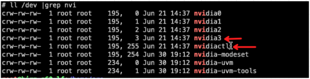
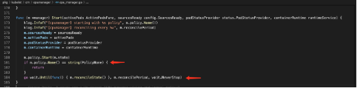
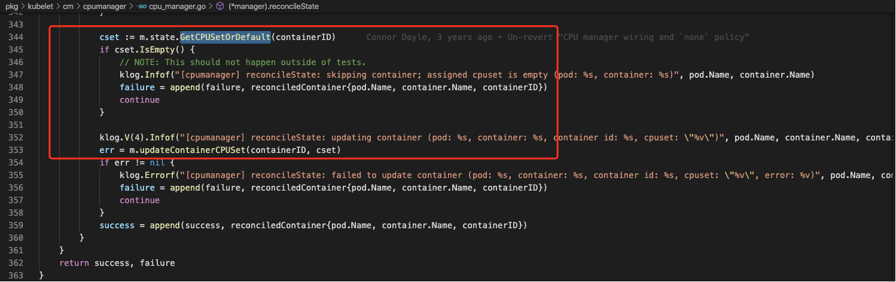
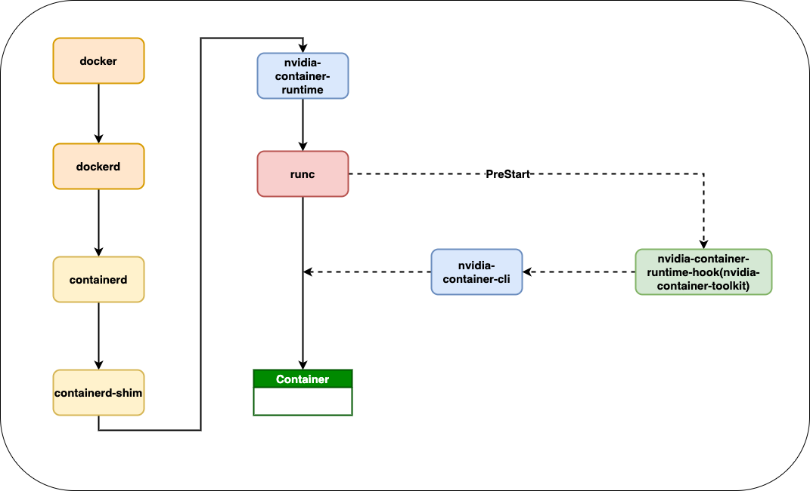
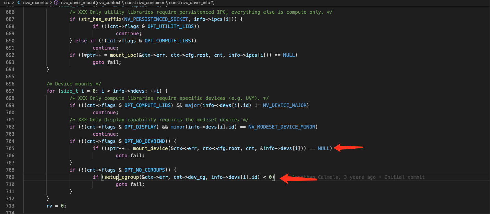

# 1- 为什么 static cpu manager 下不能使用 gpu

## 问题发现

当kubelet设置了--cpu-manager-policy=static参数后，使用了gpu的容器，在启动后不久会发现，服务在容器内失去了对gpu设备的使用权限。执行nvidia-smi将会报如下异常：

```
Failed to initialize NVML: Unknown Error
```

当我们比较正常容器和异常容器的device.list文件发现了不同，异常容器的device.list(device.list里记录的是cgroup中支持访问的设备列表。)少了两个设备的访问权限。

```
正常容器的devices.list文件内容
c 1:5 rwm
c 1:3 rwm
c 1:9 rwm
c 1:8 rwm
c 5:0 rwm
c 5:1 rwm
c *:* m
b *:* m
c 1:7 rwm
c 136:* rwm
c 5:2 rwm
c 10:200 rwm
c 195:255 rw（异常容器中缺少的）
c 195:3 rw（异常容器中缺少的）

异常容器的devices.list文件内容
c 1:5 rwm
c 1:3 rwm
c 1:9 rwm
c 1:8 rwm
c 5:0 rwm
c 5:1 rwm
c *:* m
b *:* m
c 1:7 rwm
c 136:* rwm
c 5:2 rwm
c 10:200 rwm
```

我们可以看下/dev中缺少的两项device对应的设备名称,就是gpu卡和nvidia-smi使用到的nvidiactl


用strace命令跟踪一下nvidia-smi的执行过程中的系统调用，找一下为什么不能访问gpu设备了。发现是容器内没有权限访问 nvidiactl：

```
strace -v -a 100 -s 1000 nvidia-smi
close(3)                                                                                           = 0
open("/dev/nvidiactl", O_RDWR)                                                                     = -1 EPERM (Operation not permitted)
open("/dev/nvidiactl", O_RDONLY)                                                                   = -1 EPERM (Operation not permitted)
fstat(1, {st_dev=makedev(0, 704), st_ino=4, st_mode=S_IFCHR|0620, st_nlink=1, st_uid=0, st_gid=5, st_blksize=1024, st_blocks=0, st_rdev=makedev(136, 1), st_atime=2019/04/23-17:35:28.678347231, st_mtime=2019/04/23-17:35:28.678347231, st_ctime=2019/04/23-17:33:09.682347235}) = 0
write(1, "Failed to initialize NVML: Unknown Error\n", 41Failed to initialize NVML: Unknown Error
)                                         = 41
exit_group(255)                                                                                     = ?
+++ exited with 255 +++

```

## 问题追踪

为什么会出现这种问题呢，kubelet加了一个--cpu-manager-policy=static的参数，会导致容器运行过程中丢失设备。要搞清楚这个问题肯定得从两方面查一下，一个是增了--cpu-manager-policy=static参数后 kubelet的工作流发生了那些变化，这些变化又是如何影响到底层容器的。

--cpu-manager-policy=static的功能是啥？默认情况下kubelet创建的pod都是通过CFS配额的方式来分配使用物理机的cpu资源。而static cpu manager提供了cpu set的功能。能够给某些container绑定指定的 cpus，达到绑定邦核的能力，提升cpu敏感型任务的性能。按照线上生产环境的数据显示container如果使用了 cpu set，业务的性能提升在 15%-26%左右。

static cpu manager policy与none cpu manager policy 有什么不同？通过了解 cm 部分的代码，发现 static cpu manager会动态的定时的更新所有container的cpu set配置。



cpu manager启动时，如果是none cpu manager policy，就直接返回了，如果是static cpu manager则会启动一个gorouting做reconcile。继续跟踪reconcileState方法。



在reconcileState方法中，cm会不停的通过GetCPUSetOrDefault方法获取容器的cpu set。更新容器的cpu set。GetCPUSetOrDefault方法根据containerID获取 cpu set，如果 pod 是一个 guaranteed pod，返回的就是容器的 cpu set。否则，则返回的就是 default值。default 值得含义是："除了guaranteed pod分配走的cpu core外，其余的所有的cpu core都算在了default值里"。因此所有的容器在运行过程中都会定时、动态的更新cpu set值。为什么要怎么做呢？主要有两个原因：

- 使用CFS配额的容器为使用cpu set的容器，让出 cpu core。因为add guaranteed pod之后，default值会变小。如果不更新非guaranteed pod的container，就无法保证guaranteed pod的container独占cpu core,达不到绑核的目的。updata 后，使用CFS配额的容器就给使用cpu set的容器让出了cpu core，使用cpu set的container就可以完全独占cpu core.
- 保持内存中的cpu 分配数据和实际容器使用的情况一致。

现在我们知道static cpu manager和none cpu manager的不同，主要是多了reconcileState中的 updateContainerCPUSet的操作。updateContainerCPUSet为什么会导致gpu没办法用了呢？要搞懂这个问题还得了解一下nvidia container的启动原理。
这个是 nvidia 官方给出的一个 nvidia docker 启动的流程图：


下面这个是我自己摸索代码整理出来的一个更详细的流程图：

首先简单介绍下各个组件的功能：

- docker是docker的客户端工具，用来把用户的请求发送给dockerd.
- dockerd也被称为docker engine,接受客户端的请求并做处理。kubelet与dockerd通信使用的是unix sock 方式,kubelet内置了一个docker-shim,docker-shim实现了类似docker client的功能可以与docker engine 通信。
- Containerd管理完整的容器生命周期（从创建容器到销毁容器)，拉取/推送容器镜像，存储管理(管理镜像及容器数据的存储)，调用runc运行容器(与 runc等容器运行时交互)，管理容器网络接口及网络。
- Containerd-shim 是containerd的组件，是容器的运行时载体，我们在docker宿主机上看到的shim也正是代表着一个个通过调用containerd启动的docker容器。
- nvidia-container-runtime,nvidia的runtime(符合OCI标准的runtime实现)，但其实就是在runc上包装了一层，为runc增加了PreStart Hook，底层仍然运行的是runc。runc的PreStart Hook会在调用start操作之后但在执行用户指定的程序命令之前执行。
- runc 是用来起停以及更新容器的runtime，可以对容器执行包括 create,delete,kill,start，update 等操作。
- nvidia-container-runtime-hook，就是nvidia-container-runtime为runc注入的PreStart hook ,nvidia-container-runtime-hook会去检查容器是否需要使用GPU(通过环境变量 NVIDIA_VISIBLE_DEVICES来判断)。如果需要则调用libnvidia-container-cli来暴露GPU给容器使用。否则走默认的runc逻辑。
- libnvidia-container-cli将nvidia驱动库的so文件和GPU设备信息，通过文件挂载的方式映射到容器中。

从梳理上面组件的功能，我们可以发现一个问题：

- libnvidia-container-cli将nvidia驱动库的so文件和GPU设备信息是通过文件挂载的方式挂载到容器中，并添加cgroup访问权限。而挂载的过程中，有没有将这部分信息同步给docker engine(或者说这部分挂载信息并没有添加到容器的cgroup config中)。runc在update过程中调用device Set方法，是根据容器的cgroup config中的内容重新调整device相关的文件。从代码中我们也可以证实这点。在这个过程中，就会丢失 libnvidia-container-cli加入的设备。
  

## 修复方法

### 1.kubelet cm 增加 patch

最开始，我们在 kubelet 的 cm 模块做了修复，修复方案：在开启 static cpu manager 情景下，cm 模块中根据 containerID 获取 cpu set，如果 cpu set 不为空，我们就跳过这个容器，不执行 updateContainerCPUSet。如果没有跳过，这个容器肯定就是用的 default cpu set，那我们就可以调整容器的 cpuset 了。


```Golang
func (m *manager) reconcileState() (success []reconciledContainer, failure []reconciledContainer) {
    m.containerMap.Add(string(pod.UID), container.Name, containerID)
	  m.Unlock()
   // --------------------------------以上代码未改动 --------------------------------
			cset,ok := m.state.GetCPUSet(string(pod.UID), container.Name)

			if ok && !cset.IsEmpty() && isGPUPod(pod){
				klog.Infof("[cpumanager] reconcileState: skipping container; is gpu pod and cpu set not empty (pod: %s, container: %s)", pod.Name, container.Name)
				failure = append(failure, reconciledContainer{pod.Name, container.Name, containerID})
				continue
			}
    // --------------------------------以下代码未改动 --------------------------------
    cset = m.state.GetCPUSetOrDefault(string(pod.UID), container.Name)
			if cset.IsEmpty() {
				// NOTE: This should not happen outside of tests.
				klog.Infof("[cpumanager] reconcileState: skipping container; assigned cpuset is empty (pod: %s, container: %s)", pod.Name, container.Name)
				failure = append(failure, reconciledContainer{pod.Name, container.Name, containerID})
				continue
			}
}

```

但是这个方案是有局限性的:
* 解决不了节点开启了static cpu manager但是GPU容器没有使用cpu set的场景。如果GPU容器没有使用cpu set，但是节点仍然开启了static cpu manager policy。那么从cm模块设计上，由于GPU容器没有使用cpu set，它必须要未使用了cpu set的容器让出cpu core，那么它必然会被执行updateContainerCPUSet的操作。

### 2. runc 增加 patch

在了解nvidia docker的工作原理后，感觉可以从runc上修复一下。从 runc 修复的方案，肯定是要根据 device.deny ,device.allow,device.list 文件的内容，在 devcie Set 时，可以把 nvidia 设备加回去，或者跳过设备的更新。但是我们知道 device.deny ,device.allow 这两个文件是只能写入的，不可读。我们不能从这两个文件中读出来上次的设备再给加回去。因此我们只能根据 device.list 文件的内容做一些处理。这里我们做的处理是，当我们发现 device.list 文件中的内容发生改变后（即不是初始化的内容），就不再根据 cgroup config 中的内容更新 device.deny ,device.allow 文件，就不会发生 gpu 设别丢失的问题。当然这样做是基于一个合理的假设，即目前kuberntes不会在容器运行时，动态的更新容器挂载的设备。所有device的更新都必须走容器的重启。

```Golang
func (s *DevicesGroup) Set(path string, cgroup *configs.Cgroup) error {
	if system.RunningInUserNS() {
		return nil
	}

	devList, err := fscommon.ReadFile(path, "devices.list")
	if err != nil {
		return err
	}
	// "a *:* rwm" is devices.list's initial value
	// if devList starts with "a *:* rwm", it means that it's the first time to set devices cgroup
	// if it doesn't, it means that devices cgroup has been updated, so just return.
	if !strings.HasPrefix(devList, "a *:* rwm") {
		return nil
	}

	devices := cgroup.Resources.Devices
	if len(devices) > 0 {
		for _, dev := range devices {
			file := "devices.deny"
			if dev.Allow {
				file = "devices.allow"
			}
			if err := fscommon.WriteFile(path, file, dev.CgroupString()); err != nil {
				return err
			}
		}
		return nil
	}
	if cgroup.Resources.AllowAllDevices != nil {
		if *cgroup.Resources.AllowAllDevices == false {
			if err := fscommon.WriteFile(path, "devices.deny", "a"); err != nil {
				return err
			}

			for _, dev := range cgroup.Resources.AllowedDevices {
				if err := fscommon.WriteFile(path, "devices.allow", dev.CgroupString()); err != nil {
					return err
				}
			}
			return nil
		}

		if err := fscommon.WriteFile(path, "devices.allow", "a"); err != nil {
			return err
		}
	}

	for _, dev := range cgroup.Resources.DeniedDevices {
		if err := fscommon.WriteFile(path, "devices.deny", dev.CgroupString()); err != nil {
			return err
		}
	}

	return nil
}
```