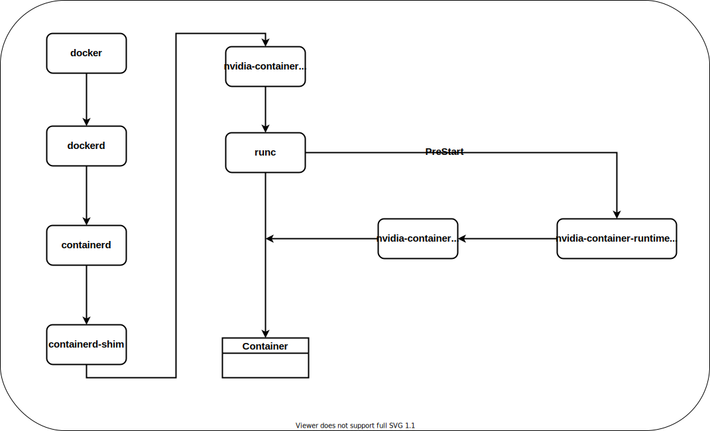

# 1- 为什么 static cpu manager 下不能使用 gpu

## 问题发现

当 kubelet 设置了--cpu-manager-policy=static 参数后，使用了 gpu 的容器，在启动后不就会发现，服务在容器内失去了对 gpu 设备的使用权限。执行 nvidia-smi 将会报如下异常：

```
Failed to initialize NVML: Unknown Error
```

当我们比较正常容器和异常容器的 device.list 文件发现了不同，异常容器的 device.list 少了两个设备的访问。device.list 里记录的是 cgroup 中支持的设备列表。

```
正常容器的devices.list文件内容
c 1:5 rwm
c 1:3 rwm
c 1:9 rwm
c 1:8 rwm
c 5:0 rwm
c 5:1 rwm
c *:* m
b *:* m
c 1:7 rwm
c 136:* rwm
c 5:2 rwm
c 10:200 rwm
c 195:255 rw
c 195:3 rw

异常容器的devices.list文件内容
c 1:5 rwm
c 1:3 rwm
c 1:9 rwm
c 1:8 rwm
c 5:0 rwm
c 5:1 rwm
c *:* m
b *:* m
c 1:7 rwm
c 136:* rwm
c 5:2 rwm
c 10:200 rwm
```

我们可以看下缺少的两项 device,就是 gpu 卡和 nvidia-smi 使用到的 nvidiactl


用 trace 跟踪一下，为啥不访问 gpu 设备了,发现容器内没有权限访问 nvidiactl：

```
strace -v -a 100 -s 1000 nvidia-smi
close(3)                                                                                           = 0
open("/dev/nvidiactl", O_RDWR)                                                                     = -1 EPERM (Operation not permitted)
open("/dev/nvidiactl", O_RDONLY)                                                                   = -1 EPERM (Operation not permitted)
fstat(1, {st_dev=makedev(0, 704), st_ino=4, st_mode=S_IFCHR|0620, st_nlink=1, st_uid=0, st_gid=5, st_blksize=1024, st_blocks=0, st_rdev=makedev(136, 1), st_atime=2019/04/23-17:35:28.678347231, st_mtime=2019/04/23-17:35:28.678347231, st_ctime=2019/04/23-17:33:09.682347235}) = 0
write(1, "Failed to initialize NVML: Unknown Error\n", 41Failed to initialize NVML: Unknown Error
)                                         = 41
exit_group(255)                                                                                     = ?
+++ exited with 255 +++

```

## 问题追踪

为什么会出现这种问题呢，kubelet 加了一个--cpu-manager-policy=static 的参数，会导致容器运行过程中丢失设备。要搞清楚这个问题肯定得从两方面查一下，一个是增了--cpu-manager-policy=static 参数后 kubelet 的工作流发生了那些变化，这些变化又是如何影响到底层容器的。

--cpu-manager-policy=static 的功能是啥？默认情况下 kubelet 创建的 pod 都是通过 CFS 配额的方式来分配使用物理机的 cpu 资源。而 static cpu manager 提供了 cpu set 的功能。能够给某些 container 绑定指定的 cpus，达到绑定邦核的能力，提升 cpu 敏感型任务的性能。按照线上生产环境的数据显示 container 如果使用了 cpu set，业务的性能提升在 15%-26%左右。

static cpu manager policy 与 none cpu manager policy 有什么不同？通过了解 cm 部分的代码，发现 static cpu manager 会动态的定时的更新所有 container 的 cpu set 配置。

cpu manager 启动时，如果是 none cpu manager policy，就直接返回了，如果是 static cpu manager 则会启动一个 gorouting 做 reconcile。继续跟踪 reconcileState 方法。
在 reconcileState 方法中，就是要不停的，通过 GetCPUSetOrDefault 方法获取容器的 cpu set。更新容器的 cpu set。GetCPUSetOrDefault 方法更具 containerID 获取 cpu set，如果 pod 是一个 guaranteed pod，放回的就是容器的 cpu set。否则，则返回的就是 default 值。除了 guaranteed pod 分配走的 cpu set 外，其余的所有的 cpu 都算在了 default 值里。因此所有的容器在运行过程中都会定时，动态的更新 cpu set 值。为什么要怎么做呢？主要有两个原因：

- 使用 CFS 配额的容器为使用 cpu set 的容器，让出 cpu 核。因为 add guaranteed pod 之后，default 值会变小。updata 之后，使用 CFS 配额的容器就给使用 cpu set 的容器让出了 cpu 核。
- 保持内存中的 cpu state 和 实际容器使用的一致。

现在我们知道 static cpu manager 和 none cpu manager 的不同，主要是多了 reconcileState 中的 updateContainerCPUSet 的操作。updateContainerCPUSet 为什么会导致 gpu 没办法用了呢？要搞懂这个问题还得了解一下 nvidia container 的启动原理。
这个是 nvidia 官方给出的一个 nvidia docker 启动的流程图：


下面这个是我自己摸索代码整理出来的一个更详细的流程图：

首先简单介绍下各个组件的功能：

- docker 是 docker 的客户端工具，用来把用户的请求发送给 dockerd.
- dockerd 也被成为 docker engine,接受客户端的请求并做处理。kubelet 与 dockerd 通信使用的是 unix sock 方式。
- Containerd 管理完整的容器生命周期（从创建容器到销毁容器)，拉取/推送容器镜像，存储管理(管理镜像及容器数据的存储)，调用 runC 运行容器(与 runC 等容器运行时交互)，管理容器网络接口及网络。
- Containerd-shim 是 containerd 的组件，是容器的运行时载体，我们在 docker 宿主机上看到的 shim 也正是代表着一个个通过调用 containerd 启动的 docker 容器。
- nvidia-container-runtime,nvidia 的 runtime，其实就是在 runc 上包装了一层，为容器中注入 PreStart，底层仍然运行的是 runc。
- runc 是用来起停以及更新容器的 cli，包括 create,delete,kill,start，update 等操作。
- nvidia-container-runtime-hook，就是 nvidia-container-runtime 为 runc 注入的 PreStart hook， hook 会去检查容器是否需要使用 GPU(通过环境变量 NVIDIA_VISIBLE_DEVICES 来判断)。如果需要则调用 libnvidia-container-cli 来暴露 GPU 给容器使用。否则走默认的 runc 逻辑。
- libnvidia-container-cli 将 nvidia 驱动库的 so 文件 和 GPU 设备信息， 通过文件挂载的方式映射到容器中。

从梳理上面组件的功能，我们可以发现一个问题：

- libnvidia-container-cli 将 nvidia 驱动库的 so 文件 和 GPU 设备信息是通过文件挂载的方式映射到,并添加 cgroup 访问权限。而挂载的过程中，有没有将这部分信息同步给 docker engine。runc 在 update 过程中调用 device Set 方法，是根据容器的 cgroup config 中的内容重新调整了 device 相关的文件。 从代码中我们也可以证实这点。在这个过程中，就会丢失 libnvidia-container-cli 加入的设备。
  

## 修复方法

### 1.kubelet cm 增加 patch

最开始，我们在 kubelet 的 cm 模块做了修复，修复方案：在开启 static cpu manager 情景下，cm 模块中根据 containerID 获取 cpu set，如果 cpu set 不为空，我们就跳过这个容器，不 updateContainerCPUSet。如果没有跳过，这个容器肯定就是用的 default cpu set，那我们就可以调整容器的 cpuset 了。

这个修复方案只能在集群中 gpu 容器 使用 cpu set 才奏效。如果容器没有使用 cpu set，并且节点还开启了 static cpu manager，还是会出现 GPU 设备丢失的问题。并且在线上环境中，还在线即使 gpu 容器 使用 cpu set，在容器发生 oom 的时候也会发生 GPU 设备丢失的问题。

### 2. runc 增加 patch

在了解了 nvidia docker 的工作原理后，感觉可以从 runc 上修复一下。从 runc 修复的方案，肯定是要根据 device.deny ,device.allow,device.list 文件的内容，在 devcie Set 时，可以把 nvidia 设备加回去，或者跳过设备的更新。但是我们知道 device.deny ,device.allow 这两个文件是只能写入的，不可读。我们不能从这两个文件中读出来上次的设备再给加回去。因此我们只能根据 device.list 文件的内容做一些处理。这里我们做的处理是，当我们发现 device.list 文件中的内容发生改变后（即不是初始化的内容），就不再根据 cgroup config 中的内容更新 device.deny ,device.allow 文件，就不会发生 gpu 设别丢失的问题。当然这样做是基于一个合理的假设，即目前 kuberntes 不会在容器运行时，动态的更新容器挂载的设备。

https://cloud.tencent.com/developer/article/1402119
https://www.cnblogs.com/sparkdev/p/9129334.html
