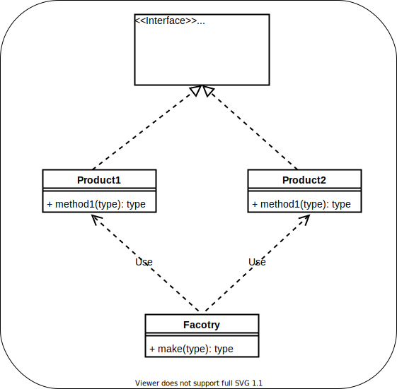
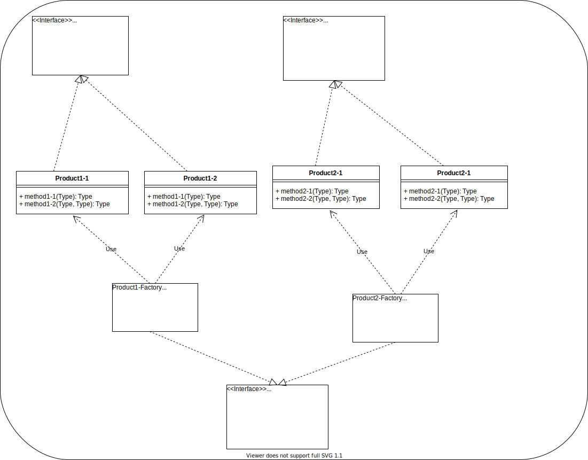
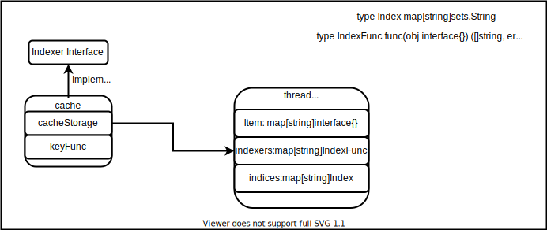

# client-go 中 informer 中的设计与实现

```
个人任务读源码的作用不是了解软件实现的工作流，更多的是思考，软件的设计模式和设计思想，未来自己在哪些地方可以使用。最后才是了解软件实现的工作流。
```

## informer 的设计模式

下面一个简单的 informer 的使用的列子，从例子中寻找 informer 设计中使用过的方法。

```
package main

import (
	"time"

	"k8s.io/client-go/informers"
	"k8s.io/client-go/kubernetes"
	"k8s.io/client-go/rest"
	"k8s.io/client-go/tools/cache"
)

func main() {
	stop := make(chan struct{}, 1)
	defer close(stop)
	config := &rest.Config{
		Host: "",
	}
	client := kubernetes.NewForConfigOrDie(config)
	factory := informers.NewSharedInformerFactory(client, 1*time.Second)
	nodeInformer := factory.Core().V1().Nodes().Informer()
	nodeInformer.AddEventHandler(&cache.ResourceEventHandlerFuncs{})
	go factory.Start(stop)

	cache.WaitForCacheSync(stop, nodeInformer.HasSynced)

}
```

### 工厂模式

从上面的 example 中，可以看出 informer 的创建使用的是工厂设计模式，先简单介绍下两种常用的工厂设计模式：

- 简单工厂：定义一个工厂类，工厂类根据调用者传入的参数，分别实例化不通的对象。
    
  在上图中实现了一个工厂类 Factory，Factory.make 可以根据调用者传入的不同参数分配实例化 Product1 和 Product2 返回
- 抽象工厂：抽象工厂是对简单工厂的再一次封装。将工程类的创建也改造成由工厂模式创建。
    
  从上图中可以看出，Product1-Factory 和 Product2-Factory 是接口 AbstractFactory 的实现，虽然他们都有 make1 和 make2 方法，通常他们都只实现自己需要的那个方法。例如在 Product1-Factory 中，他的主要功能是产生 Product1 的。所以他的 make2 方法就是一个空实现。
  采用抽象工厂模式，通常还需要实现一个方法 GetFactory，根据调用参数创建不同的 Factory 实例。Factory 实例再根据不同的参数创建不通的 Product 实例。

client-go 中 informer 使用的是哪种工厂方法呢。首先先梳理下 informer 的创建模式: 

从上图可以看出 client-go 中 informer 采用的是简单工厂，但是 informerFactory 在简单工程中又柔和了函数式编程中的链式调用。如 example 中`nodeInformer := factory.Core().V1().Nodes().Informer()`，`Core().V1().Nodes()`调用一直用 factory 和 namespace 等信息构造对应的 group,version,resource.通过这些链式调用到指定的`Informer()`唯一实例化`sharedIndexInformer`.

## informer 的实现流程

- informer 初始化流程

如图所示，SharedInformerFactory 根据 GVR 信息 create 对应的 shareIndexInformer，SharedInformerFactory 启动的时候，会启动 SharedInformerFactory create 的所有 shareIndexInformer(`SharedInformerFactorycreate的shareIndexInformer每种资源(GVK)只会创建一个shareIndexInformer`)，shareIndexInformer 启动的时候，会创建 controller 和 Reflector 并启动。从这里看一看出 informer 中主要的两个组件就是 controller 和 Reflector。其中还包括一些辅助组件`fifo queue` `indexer` 和 `processorListener`。下图是 informer 的工作原理图. 

```
1. 在平时使用client-go，我经常存在的一个疑问：产生Delete事件后，生成key放入queue中，在controller中处理，在处理过程中，我从indexer中在去get resource，此时会不会存在时间差。
	了解了client-go中informer的原理后，这个问题就可以解决了，我看到到controller中会在4中先更新indexer，在产生OnDelete事件的调用。
```

- informer.controller 组件  
  
  informer.controller 的主要作用:Run 时初始化和启动 reflector 组件，通过 processLoop 从 fifo queue 中消费 resource 并处理。如何处理呢？shareIndexInformer 在初始化 controller 时，会将自己的 HandleDeltas 作为 controller 的 process function 使用。

- informer.reflector 组件  
  
  reflector 通过 shareIndexInformer 中定义的 listerWatcher，在启动后先 list resource 写入队列，之后会 watch 并定期 resync resource，并将 resource 写入队列。

- queue 组件 
    
   **这部分代码重点学习，可以学习sync包的使用，队列实现方法**   

   informer 中 queue 使用的 fifo queue()。在了解 fifo queue 中设计思想，首先需要介绍一下 GO 中 sync 包的 Cond,Cond 是 sync 包中条件变量的一种实现，使用场景：多个 standby 的 gorouting 等待共享资源 ready。例如 fifo queue 中 Pop 方法：

  ```golang
  f.lock.Lock()
  defer f.lock.Unlock()
  ...

  for len(f.queue) == 0 {
  	// When the queue is empty, invocation of Pop() is blocked until new item is enqueued.
  	// When Close() is called, the f.closed is set and the condition is broadcasted.
  	// Which causes this loop to continue and return from the Pop().
  	if f.closed {
  		return nil, ErrFIFOClosed
  	}

  	f.cond.Wait()
  }
  ```

  Pop 方法中判断 queue 队列长度，如果队列长度等于 0，Pop 就会阻塞在这里等待，其他 gorouting 通过 Broadcast 或者 Signal 唤醒它。但是在使用 Cond.Wait()方法时，特别重要的时，一定要提前给 Cond.l 上锁，保护 Condition。因为在 Cond.Wait 方法中会先对 Cond.l 解锁。例如 Pop 方法中，先 lock，用来保护条件 `len(f.queue) == 0`。

  ```golang
  type FIFO struct {
  lock sync.RWMutex
  cond sync.Cond
  //items 用来存储队列中元素，key = keyFunc(item)
  items map[string]interface{}
  //queue 中存储item中 key，按照加入队列顺序，一次往后放。每次Pop都会先去第0个元素，再去items中寻找元素
  queue []string

  // populated initialPopulationCount 用来判断是否同步完成：reflector list出元素后，会通过
  //queue Replace 方法将resources写入队列，此时populated=ture，initialPopulationCount=len(resources)，同时controller会从队列消费， 当controller消费完所有Replace的元素后，initialPopulationCount=0，此时资源同步完成(资源都更新到了informer中的index中)
  populated bool
  initialPopulationCount int

  //keyFunc
  keyFunc KeyFunc
  //
  closed bool
  }
  type Queue interface {
  Store

  //当队列为空时，Pop操作阻塞，当队列加入元素后，Pop队列可以立即消费
  Pop(PopProcessFunc) (interface{}, error)

  // 元素不存在时，加入元素
  AddIfNotPresent(interface{}) error

  //如果第一批元素都已弹出，HasSynced返回true，第一批元素指第一个Replace操作加入的元素
  HasSynced() bool

  // Close the queue
  Close()
  }
  ```
  这里分析的普通的fifo队列的功能，实际上reflector使用的是DeltaFIFO。DeltaFIFO的功能和上面的FIFO是一样的，只是是专门用来存储Delta元素的FIFO Queue。同时DeltaFIFO在实现上还引用了index组件，用来实现rsync操作。
- indexer 组件  
  
  在controller处理元素的时候，除了将元素保存到cache，还可以为元素建立查找索引，提升查找速率。例如，可以将pod根据node name建立索引，这样，在查找某个node上的pod时候，就可以直接使用索引，而不是全量过滤pod的filed。
    
  从上图可知，client-go使用的Indexer包括两部分:
  
  - cacheStorage: 一个线程安全的map，用来存储元素和元素与索引的对应关系。
  - keyFunc: 计算元素的key

  对索引的更新最主要的方式就是 `func (c *threadSafeMap) updateIndices(oldObj interface{}, newObj interface{}, key string)`,threadSafeMap的 Add、Update最后都会调用该方法更新索引。该方法梳理，主要使用代码注释的方法。

```golang
  func (c *threadSafeMap) updateIndices(oldObj interface{}, newObj interface{}, key string) {
	// 如果 oldObj 不为空，需要先删除 oldObj
	if oldObj != nil {
		c.deleteFromIndices(oldObj, key)
  }
  //indexers中保存了每种索引的计算方法,
	for name, indexFunc := range c.indexers {
    //1.得到新对象的索引值
		indexValues, err := indexFunc(newObj)
		if err != nil {
			panic(fmt.Errorf("unable to calculate an index entry for key %q on index %q: %v", key, name, err))
    }
    //2.根据索引名字，取出索引
		index := c.indices[name] //index:map[string]set.String
		if index == nil {
			index = Index{}
			c.indices[name] = index
		}
    //3. 根据索引值，将元素更新到索引中
		for _, indexValue := range indexValues {
			set := index[indexValue]
			if set == nil {
				set = sets.String{}
				index[indexValue] = set
			}
			set.Insert(key)
		}
	}
}
```
  
- processorListener 组件

   **这部分代码重点学习，如何利用channel实现一个带有速率限制的处理器**   

  在使用informer的时候，可以注册eventHandler，注册的eventHandler是如何被调用的呢？这部分工作就是由processorListener处理的。具体工作流如下所示：
  

## informer sync 实现机制
