# 调度器的设计与实现

## 调度器流程架构


### scheduler cache

cache 通过pod event收集pod信息，并更具Pod的NodeName做node级别的聚合。聚合的信息提供给generic scheduler使用。
在源码中，作者特意强了cache中数据主要依据pod event。这种方式并不是一个可靠的方式。很可能会因为网络的不稳定导致Reflector接收的数据滞后，或者watch异常导致重新relist，这些问题都可能会导致事件的丢失。

shedulerCache 数据结构:



scheduler cache为了方便定位数据不一致的问题还提供了一个debug的功能。向kube-scheduler进程发送 -12 的信号后，scheduler cache会将内存中的NodeInfo、assumedPods dump打印到日志中。

### SchedulingQueue 

schedulingQueue 实质上是一个优先级队列。


> 从学习cache 和 queue的代码中，可以明显的看到接口编程的好处。cache和queue都先定义好功能需要对外暴露的接口。然后自己实现内部的处理逻辑，来满足用户功能的需要。实现功能上的解耦。

### scheduler Framework

## 调度算法

### 排队策略

默认的待调度的pod 在优先级队列中的排队策略是根据`pod.Spec.Priority`,`pod.Spec.Priority`高的优先被调度。如果两个Pod的 Priority相等，则创建时间早的优先级高。

>> 问题： 排队策略调用的位置？

### 预选阶段
预算阶段包括：PreFilter Filter PostFilter，三个阶段的部分算法有重合。

>> 问题：分成三个阶段，部分算法还有重合，不会降低的调度器的效率？为什么要这么做？

#### PreFilter 插件

PreFilter插件的方法都必须实现PreFilterPlugin接口。

```golang
// Plugin is the parent type for all the scheduling framework plugins.
type Plugin interface {
    //Name方法返回插件的名字
	Name() string
}
type PreFilterPlugin interface {
	Plugin
    //PreFilter 在调度周期开始时调用.只有所有的PreFilter插件都返回success，pod的调度才能继续，否则pod的调度会被终止。
	PreFilter(ctx context.Context, state *CycleState, p *v1.Pod) *Status
    //PreFilterExtensions 返回实现PreFilterExtensions接口的插件或者nil.PreFilterExtensions提供了AddPod/RemovePod方法，scheduler framework保证PreFilterExtensions一定在PreFilter之后被调用。AddPod/RemovePod方法可能会使用过CycleState Clone数据，也有可能会在Filter之前多次被调用。
	PreFilterExtensions() PreFilterExtensions
}
```


* NodeResourcesFit

    NodeResourcesFit的PreFilter方法计算Pod的Request的资源总量写入cycleState中.这里有一个点需要注意的是：计算的Request的资源总量数据是不包括init container的。在计算时，会比较long running 容器的资源总量和init容器的大小，取最大值。

    >> 为什么要将计算资源放到PreFilter中，在Filter使用的时候再计算会有什么问题?
    >> 我理解，这里计算出来，存入cycleState中,之后在PreFilter和Filter阶段，用户添加了自定义的plugin时，可以直接使用这部分数据，减少计算耗时。


* NodePorts
    NodePorts的PreFilter方法将Pod中所有container的ContainerPort整理写入cycleState中。

* PodTopologySpread
    PodTopologySpread([Pod拓扑扩展约束](https://kubernetes.io/zh/docs/concepts/workloads/pods/pod-topology-spread-constraints/))在PreFilter阶段的主要工作就是统计每个topologyValue的pod数量。

* InterPodAffinity
   InterPodAffinity

* VolumeBinding


#### Filter 插件

* NodeResourcesFit

    NodeResourcesFit的Filter方法，从cycleState中取出PreFilter阶段存入的Pod Request Resource,计算是否满足: `node.Request+pod.Request < node.Allocatable`

* NodePorts
    NodePorts的Filter方法，从cycleState中取出PreFilter阶段存入的Pod使用的ContainerPort数据，计算Pod申请使用的`[协议:IP:端口]`是否和Node上已分配出去的端口有冲突。

* PodTopologySpread
  
    PodTopologySpread的Filter方法，从cycleState中取出PreFilter阶段存储的数据，计算将pod调度到该node上是否会打破maxSkew(pod最大不均衡)的限制。

* InterPodAffinity

* VolumeBinding
* NodeUnschedulable
* NodeName
* NodeAffinity
* VolumeRestrictions
* TaintToleration
* EBSLimits
* GCEPDLimits
* NodeVolumeLimits
* AzureDiskLimits
* VolumeBinding
* VolumeZone


#### PostFilter 插件

* DefaultPreemption


### 优选阶段

#### PreScore 插件

* InterPodAffinity
* PodTopologySpread
* TaintToleration


#### Score 插件

* NodeResourcesBalancedAllocation

    NodeResourcesBalancedAllocation 权重1。

* ImageLocality

    ImageLocality 权重1。

* InterPodAffinity

    InterPodAffinity 权重1. 

* NodeResourcesLeastAllocated

    NodeResourcesLeastAllocated 权重1.

* NodeAffinity

    NodeAffinity 权重1.

* NodePreferAvoidPods

    NodePreferAvoidPods 权重10000

*  PodTopologySpread

    PodTopologySpread 权重2

* TaintToleration
  
    TaintToleration 权重1.           


### Reserve 插件

* VolumeBinding

### PreBind 插件

* VolumeBinding

### Bind 插件

* DefaultBinder

## 调度器扩展

在scheduling-framework中可以通过plugins的方式在kubernetes scheduler中定义新的扩展点和Go APIs.Plugins可以直接编译进调度器中，为调度器添加新的调度策略。在调度器的配置中可以定义Plugins是否启动以及插件的顺序。自定义调度器推荐使用out-of-tree的方式实现自己的Plugins。
    Pod的调度分为两个部分：调度和绑定。调度是为pod筛选 一个node，绑定则是将调度结果作用到集群中。调度和绑定虽然是不同的部分，但同属于一个调度上下文。调度周期是一个串行的过程，而绑定可以并行实现。
    当Pod确定不可调度或者调度器内部异常时，调度周期和绑定周期可以退出。但是，需要将Pod重新塞回队列中，再次尝试调度。绑定周期异常退出时，还需要触发Un-reserve plugin。
    


上图中展示了一个调度周期的上下文，以及Scheduling framework对外暴露的扩张点。Filter 阶段相当于原来的预算阶段，Scoring相当于原来的优选阶段。每一个扩展点可以注册一个或多个Plugins。
* Queues sort：对调度队列中的pod进行排序，Queues sort插件必须实现less（pod1，pod2）方法。Queues sort插件只能绑定一个。
* Pre-filter：在pod调度之前对pod进行预处理工作，或者检查集群、pod必须满足的条件。Pre-filter插件必须实现PreFilter方法。如果PreFilter方法返回error，则调度周期会被终止。在一个调度周期PreFilter方法只会被执行一次。Pre-filter plugin还提供了AddPod和RemovePod操作。这两个操作在PreFilter后执行。（AddPod方法评估当PodA正在调度时，我们将PodB调度到node上时的影响，removePod方法的左右于此类似）
* Filter：Filter Plugin用来过滤不满足条件的node。每一个node，调度器按照Filter Plugin注册的顺序调用。如果有一个Plugin标记node不满足条件，对node的过滤就结束了，后面的Plugin不会过滤。为了提高性能，node的过滤xuyao并发执行。
* Post-filter：用来更新数据和生成metrics指标，同时也可以作为Pre-Scoring的插件使用。
* Scoring：插件分为两个阶段，Score和 NoremalizeScore，Score调用每个插件对node打分，NoremalizeScore，在调度器对node排序前，对节点得分修改。Scoring插件最后计算的分数必须是[MinNodeScore, MaxNodeScore]之间的一个整数。否则调度周期会被终止。在NoremalizeScore之后，调度器回根据每个插件配置的权重计算node的总分数。NoremalizeScore主要是为了解决Score方法计算的分数不在[MinNodeScore, MaxNodeScore]之间。
* Reserve：在某个节点为pod预留资源时，Reserve插件可以提醒调度程序。
* Permit：用来批准，拒绝，延时pod的绑定
* Pre-bind：在绑定前执行一些操作
* Bind：实现绑定pod，可以注册多个，会按照注册的顺序执行。每一个插件可以选择是否绑定操作。如果插件选择执行绑定，则后面的插件将会跳过。
* Post-bind：pod被成功绑定后执行，可以用来清理一些关联资源。
* Un-reserve：如果pod保留了资源，但是pod调度失败了，Un-reserve插件将会被调用，释放保留的资源。


Scheduling-framework 插件方法中的两个重要参数:
* CycleState：提供了访问当前调度上下文的数据的方法，可以在不同的Plugin中共享数据。在调度上下文结束后CycleState中的数据时无效的，Plugin应该及时清理。
* FrameworkHandle：CycleState提供了在当个调度上下文中共享数据的方法，FrameworkHandle提供的是在插件生命周期内共享数据的方法。插件可以从FrameworkHandle中获取kubernetes.Interface和SharedInformerFactory或者获取scheduler的共享数据。FrameworkHandle提供对kubernetes API服务器和调度程序的内部缓存的访问。不能保证两者都是同步的，编写使用这两个数据的插件时应格外小心。

插件初始化与并发


* 插件的初始化包括两步：插件注册和插件实例化。在插件实例化过程中，如果一个插件注册到多个扩展点，只会实例化一次。
* 在调度程序的主线程中，一次仅处理一个调度周期。在下一个调度周期开始之前，Reserver Plugins之前的所有扩展点都会完成。在Reserver阶段之后，绑定周期是异步执行的。这意味着调度器可以从两个不同的调度上下文中同时调用同一个绑定阶段的插件。在绑定阶段的插件如果持有状态应谨慎处理这些情况。


## leader选举机制